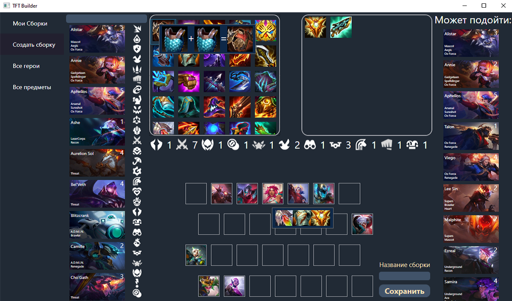
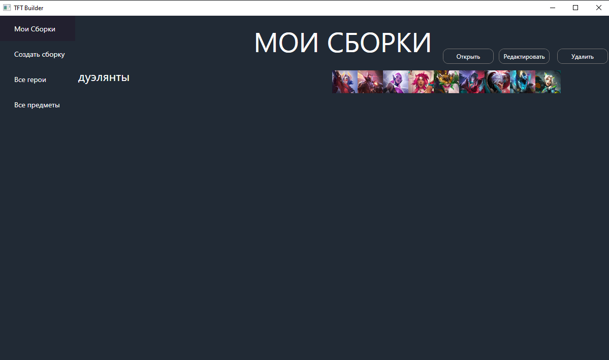
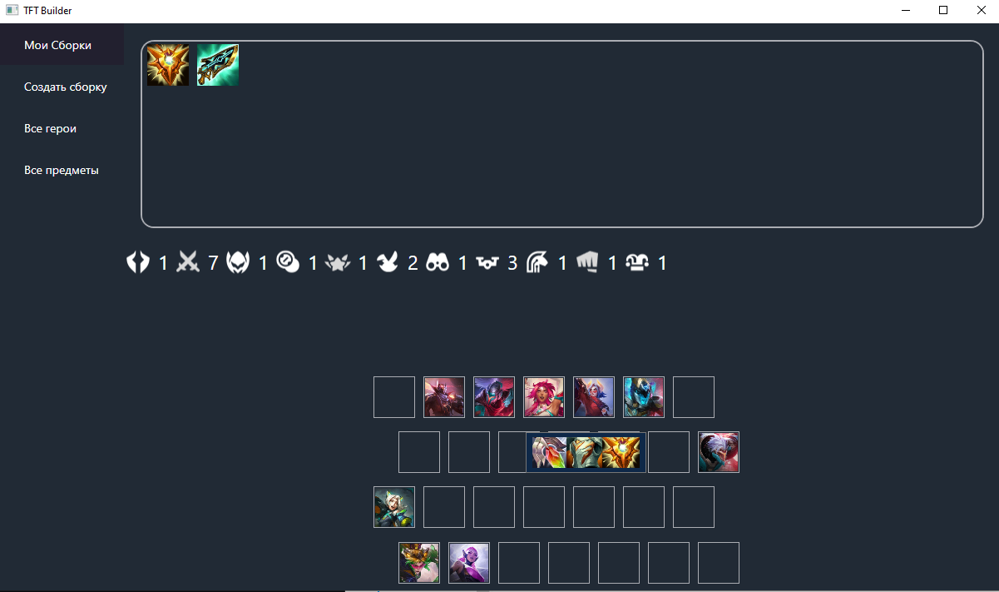
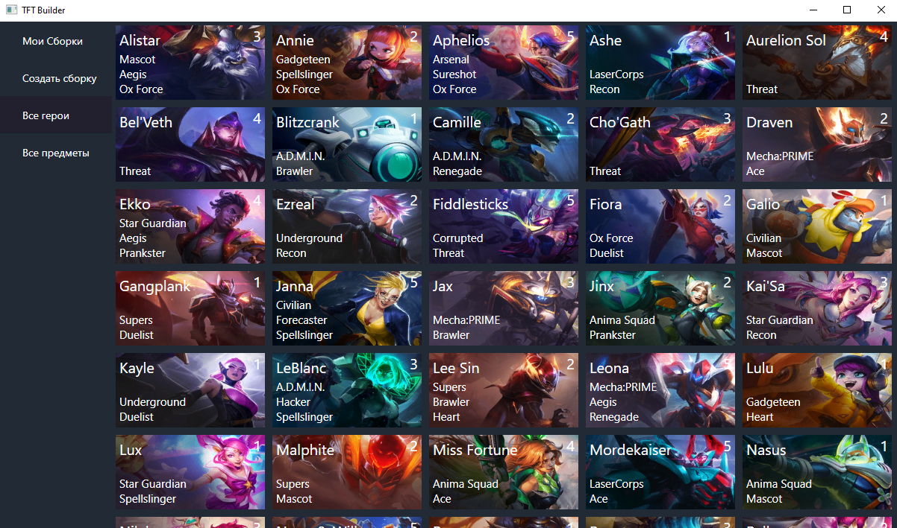
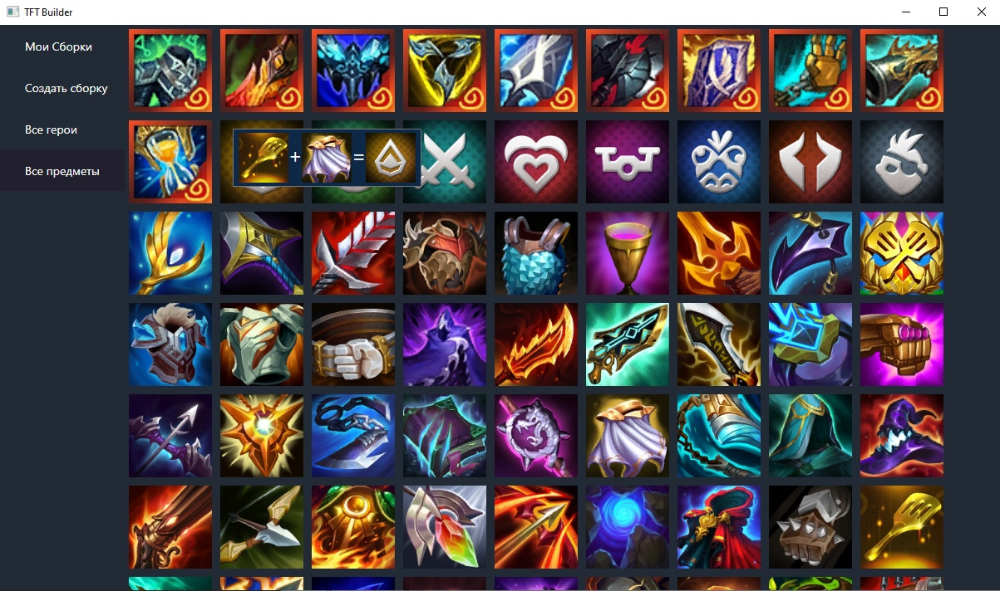

<<<<<<< HEAD
<<<<<<< HEAD
# Teamfight Tactics Team Builder

### __________________________________________

### Приложение создано на фреймворке WPF с применением патерна MVVM сопровожденный комментариями в коде

#### Существует оно для облегчения игры в Teamfight Tactics путем создания своей команды заранее, и просмотром сколько классов в ней будет, а так же распределения предметов между героями для полной их синергии, по мелочи в программе присуствует подсказчик который предлагает чем можно дополнить вашу команду

#### ___________________________________________________

Вкладка с созданием сборки, где есть список всех героев слева, филтр поиска по именни и их классам, справа находитсья список с героями которые могут подойти в вашу сборку, по середине все предметы и предметы которые нужны в команду, при наведении на них будет показываться крафт, так же их можно перемещать в героев на случай если хотите сразу распределить их по героям и не запоминать это, внизу находиться игровое поле с расположением героев как в самой игре Teamfight Tactics

Вкладка с отображением всех сохраненых сборок

Вкладка с собраной сборкой

Вкладка все герои

Вкладка со всеми предметами при наведении на которые показывает их крафт
=======
# Teamfight Tactics Team Builder

### __________________________________________

### Приложение создано на фреймворке WPF с применением патерна MVVM сопровожденный комментариями в коде

#### Существует оно для облегчения игры в Teamfight Tactics путем создания своей команды заранее, и просмотром сколько классов в ней будет, а так же распределения предметов между героями для полной их синергии, по мелочи в программе присуствует подсказчик который предлагает чем можно дополнить вашу команду

#### ___________________________________________________

Вкладка с созданием сборки, где есть список всех героев слева, филтр поиска по именни и их классам, справа находитсья список с героями которые могут подойти в вашу сборку, по середине все предметы и предметы которые нужны в команду, при наведении на них будет показываться крафт, так же их можно перемещать в героев на случай если хотите сразу распределить их по героям и не запоминать это, внизу находиться игровое поле с расположением героев как в самой игре Teamfight Tactics

Вкладка с отображением всех сохраненых сборок

Вкладка с собраной сборкой

Вкладка все герои

Вкладка со всеми предметами при наведении на которые показывает их крафт
>>>>>>> e0a269666883a2b2c6492e6c6115612be2c37e9e
=======
# Teamfight Tactics Team Builder

### __________________________________________

### Приложение создано на фреймворке WPF с применением патерна MVVM сопровожденный комментариями в коде

#### Существует оно для облегчения игры в Teamfight Tactics путем создания своей команды заранее, и просмотром сколько классов в ней будет, а так же распределения предметов между героями для полной их синергии, по мелочи в программе присуствует подсказчик который предлагает чем можно дополнить вашу команду

#### ___________________________________________________

Вкладка с созданием сборки, где есть список всех героев слева, филтр поиска по именни и их классам, справа находитсья список с героями которые могут подойти в вашу сборку, по середине все предметы и предметы которые нужны в команду, при наведении на них будет показываться крафт, так же их можно перемещать в героев на случай если хотите сразу распределить их по героям и не запоминать это, внизу находиться игровое поле с расположением героев как в самой игре Teamfight Tactics

Вкладка с отображением всех сохраненых сборок

Вкладка с собраной сборкой

Вкладка все герои

Вкладка со всеми предметами при наведении на которые показывает их крафт
>>>>>>> e0a269666883a2b2c6492e6c6115612be2c37e9e
